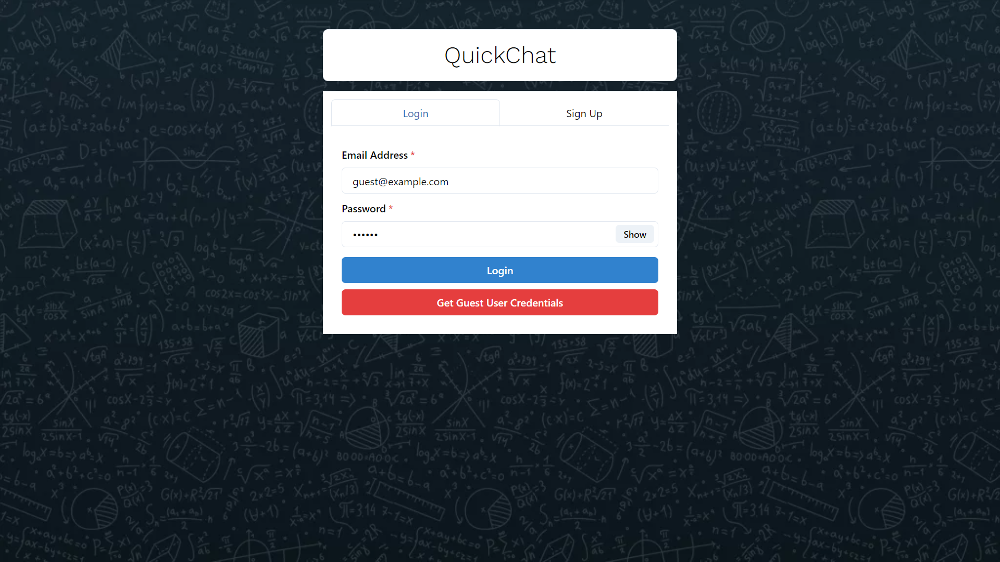
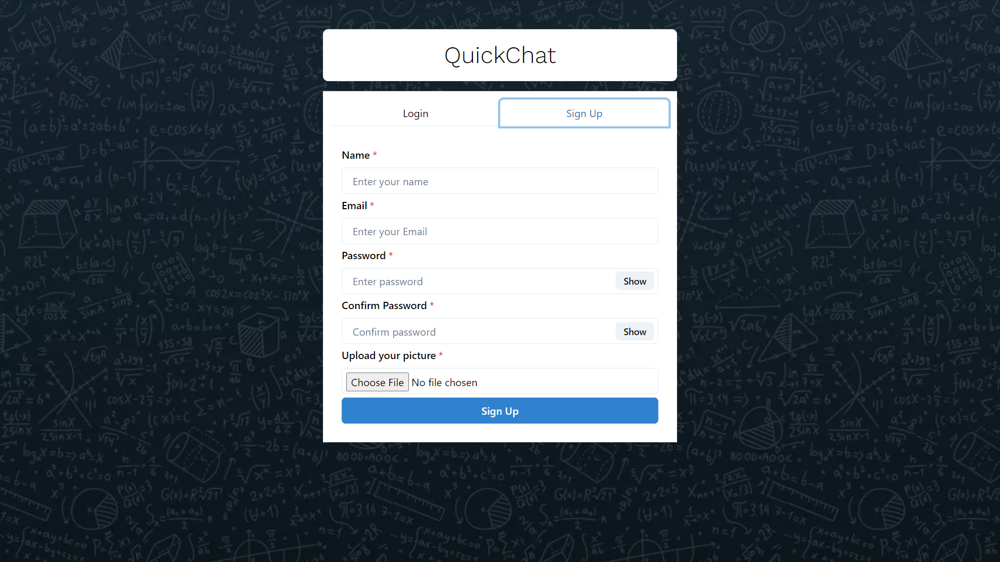

# __QuickChat__ 💬

- __Deployed Backend__ = https://
- __Deployed Webite__ = https://

---
<br/>

## 🏷️ What is __QuickChat__ ?

__QuickChat__ is a Full Stack Chatting App. Uses Socket.io for real time communication and stores user details in encrypted format in Mongo DB Database.

---

<br/>

## 🏷️ __Tech Stack Used__ :-

__Frontend__:
- HTML5
- CSS3
- JavaScript
- React.js

__Backend__:
- Node.js
- Express.js
- Socket.io

 **Database:** Mongo DB

<br/>

## 🏷️ __Special Features of QuickChat__ :-

- ### __Authenticaton__
<div style="display: flex; justify-content: space-evenly">
  
  
</div>

<!-- - ### __Real Time Chatting with Typing indicators__ -->

<!-- 
### One to One chat
### Search Users
### Create Group Chats
### Notifications 
### Add or Remove users from group
### View Other user Profile -->


---

<br/>

## 🏷️ __API Routes__ :

| METHOD | ENDPOINT | DESCRIPTION | STATUS CODE |
| --- | --- | --- | --- |
| POST | /api/register | This endpoint should allows to register. Hash the password and store. | 201 |
| POST | /api/login | This endpoint should allow to login after comparing the user's credentails. | 201 |


## Run Locally

Clone the project

```bash
  git clone https://github.com/Ananyakumarisingh/mern-chat-app
```

Go to the project directory

```bash
  cd QuickChat
```

Install dependencies

```bash
  npm install
```

```bash
  cd frontend/
  npm install
```

Start the server

```bash
  npm run start 
```
Start the Client

```bash
  //open now terminal
  cd frontend
  npm start
```

## Made By :
- [@Ananyakumarisingh](https://github.com/Ananyakumarisingh)

  
<h3 align="center" >Thankyou for your Time 💝</h3>
